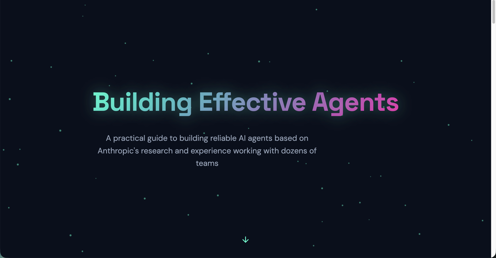
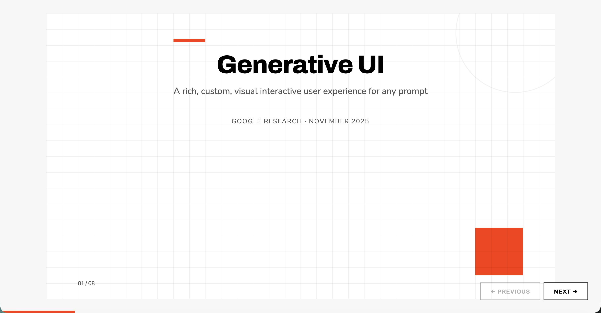
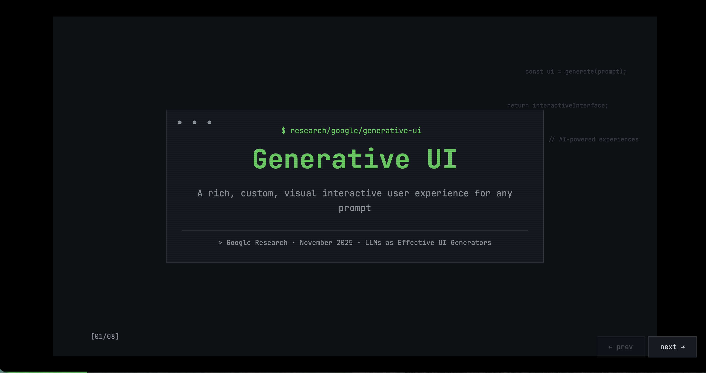

# Storytelling Web

An agent plugin (claude skill) for creating stunning, animation-rich, exploratory visual web pages from text content.

## Why

**storytelling-web** is inspired by the vision of "Explorable Explanations". We are moving away from the "Document" era into the "App-as-Content" era.

> Because some ideas are too big for a scrollbar.
>
> **storytelling-web** transforms your writing into a living, breathing digital artifact. By > combining intentional typography, cinematic motion, and interactive logic, **we turn "readers" into "explorers"**.
>
> It’s not just a converter; it's a new way to tell your story.

## Features

- **Zero Dependencies** — Output single HTML files with inline CSS/JS. No npm, no build tools.
- **Preset style** - A variety of carefully designed preset themes are available for different scenarios.
- **Multiple modes** - Slides mode (presentation-style with slide navigation) and Scrolling mode (scroll-driven narrative with progressive animations).
- **Interview mode** - Before starting, the AI ​​clarifies the user's needs by asking questions step by step, ultimately generating the desired result.
- **Production quality** - Code should be well-commented, accessible, and performant.

## Installation

### Claude Code (via Plugin Marketplace)

In Claude Code, register the marketplace first:

```plain
/plugin marketplace add wang1212/storytelling-web
```

### Other Agents

You can directly install the skills for your multiple agents:

```plain
npx skills add wang1212/storytelling-web
```

## Examples

### Building Effective Agents

Source: [anthropic.com](https://www.anthropic.com/engineering/building-effective-agents)

[](__examples__/building-effective-agents.html)

### Generative UI

Source: [research.google](https://research.google/blog/generative-ui-a-rich-custom-visual-interactive-user-experience-for-any-prompt/)

**Swiss Modern Style** — Clean, minimalist design with bold typography and geometric precision

[](__examples__/generative-ui-swiss-modern.html)

**Terminal Green Style** — Retro terminal aesthetic with monospace fonts and glowing green accents

[](__examples__/generative-ui-terminal-green.html)

## Inspired by

- [Frontend Slides](https://github.com/zarazhangrui/frontend-slides)
- [Playground Plugin](https://github.com/anthropics/claude-plugins-official/blob/main/plugins/playground/README.md)

## License

[MIT](https://github.com/wang1212/storytelling-web/blob/main/LICENSE).
